# Architecture Documentation

This document provides detailed diagrams and explanations of the seL4 ICS Gateway Demo architecture.

## Network Architecture

### Overview

The demo uses two isolated Docker networks to simulate an industrial control system with a security gateway.

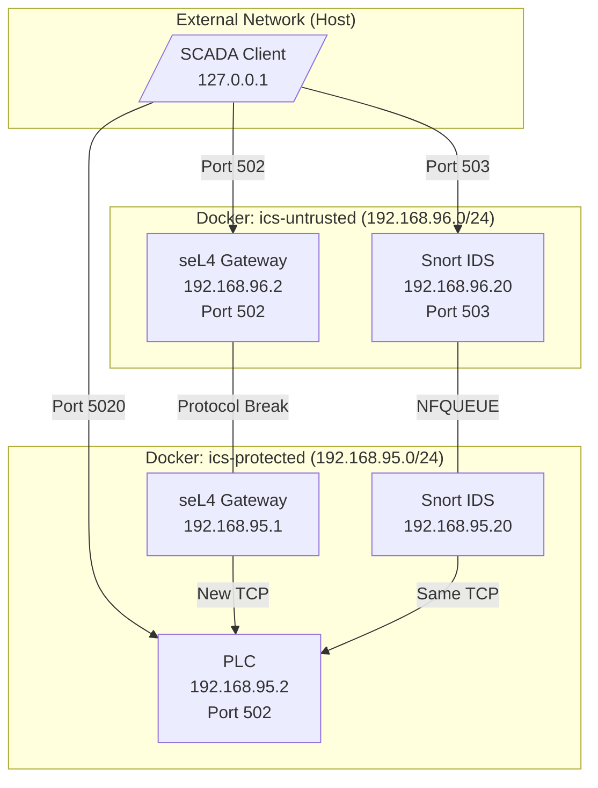

### Traffic Flow Comparison

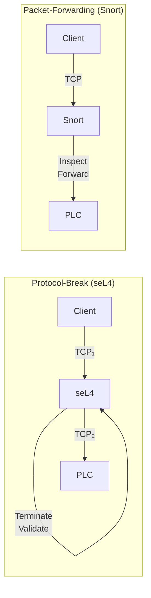

### Port Mapping

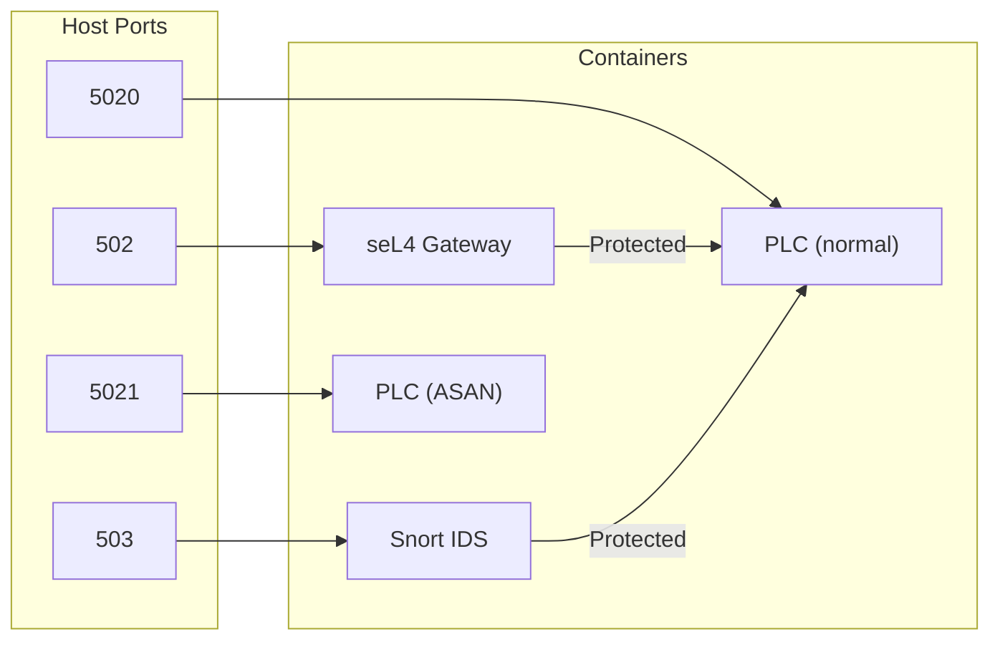

## Docker Container Architecture

### Container Relationships

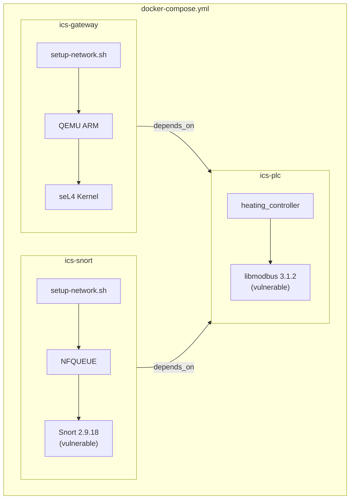

### Network Attachment

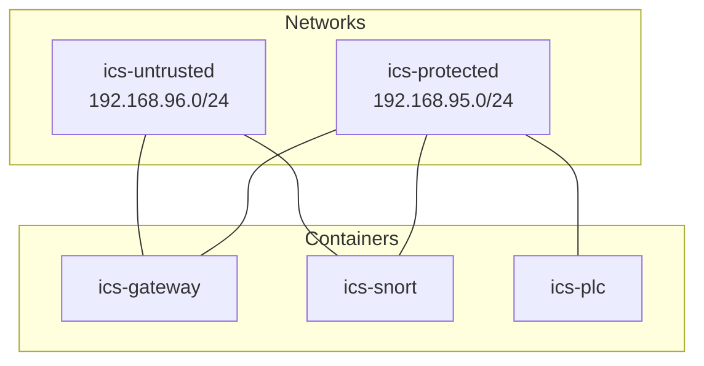

### seL4 Gateway Internal Architecture

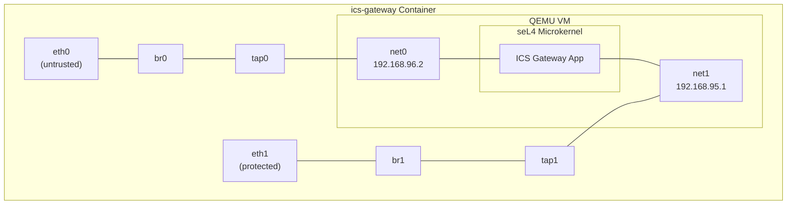

### Snort NFQUEUE Architecture

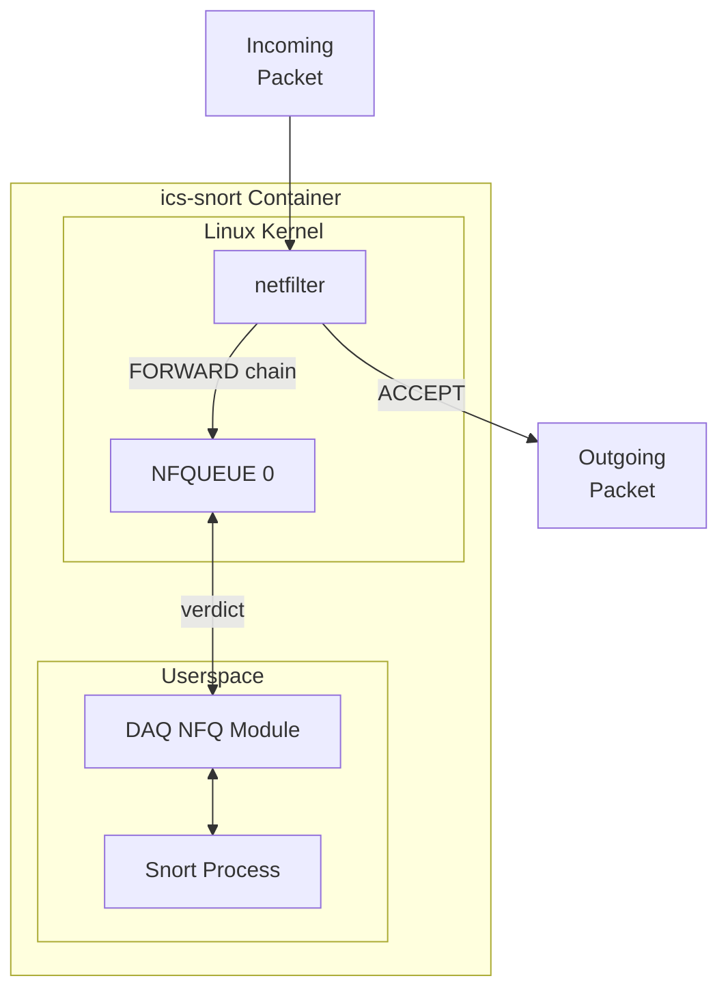

## CVE Explanations

### CVE-2019-14462: libmodbus Heap Buffer Overflow

**Affected:** libmodbus <= 3.1.2

**Severity:** High (CVSS 9.8)

**Vulnerability Type:** Heap Buffer Overflow

#### How It Works

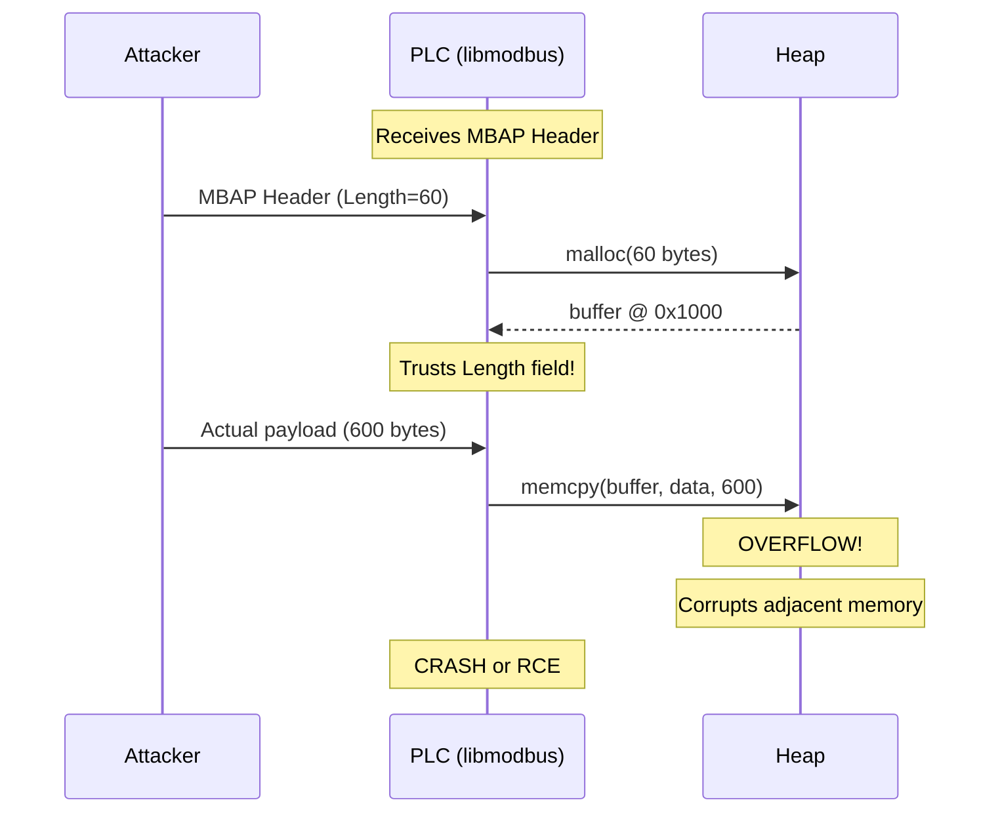

#### Vulnerable Code

```c
/* libmodbus 3.1.2 - modbus.c */
static int receive_msg(modbus_t *ctx, uint8_t *msg) {
    /* Read MBAP header (7 bytes) */
    rc = recv(ctx->s, msg, 7, 0);

    /* Extract length from header - TRUSTED! */
    length = (msg[4] << 8) | msg[5];

    /* Allocate buffer based on declared length */
    /* BUG: No validation against actual data! */

    /* Read remaining data */
    rc = recv(ctx->s, msg + 7, length - 1, 0);
    /* Attacker sends more than 'length' bytes! */
}
```

#### Attack Packet Structure

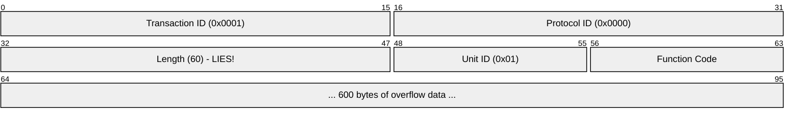

#### Protection Comparison

| Path | Result | Reason |
|------|--------|--------|
| Direct (5020) | **CRASH** | No validation |
| seL4 (502) | **BLOCKED** | Length field validated |
| Snort (503) | **DEPENDS** | Requires specific rule |

---

### CVE-2022-20685: Snort Modbus Preprocessor DoS

**Affected:** Snort < 2.9.19, Snort 3 < 3.1.11.0

**Severity:** High (CVSS 7.5)

**Vulnerability Type:** Integer Overflow causing Infinite Loop

#### How It Works

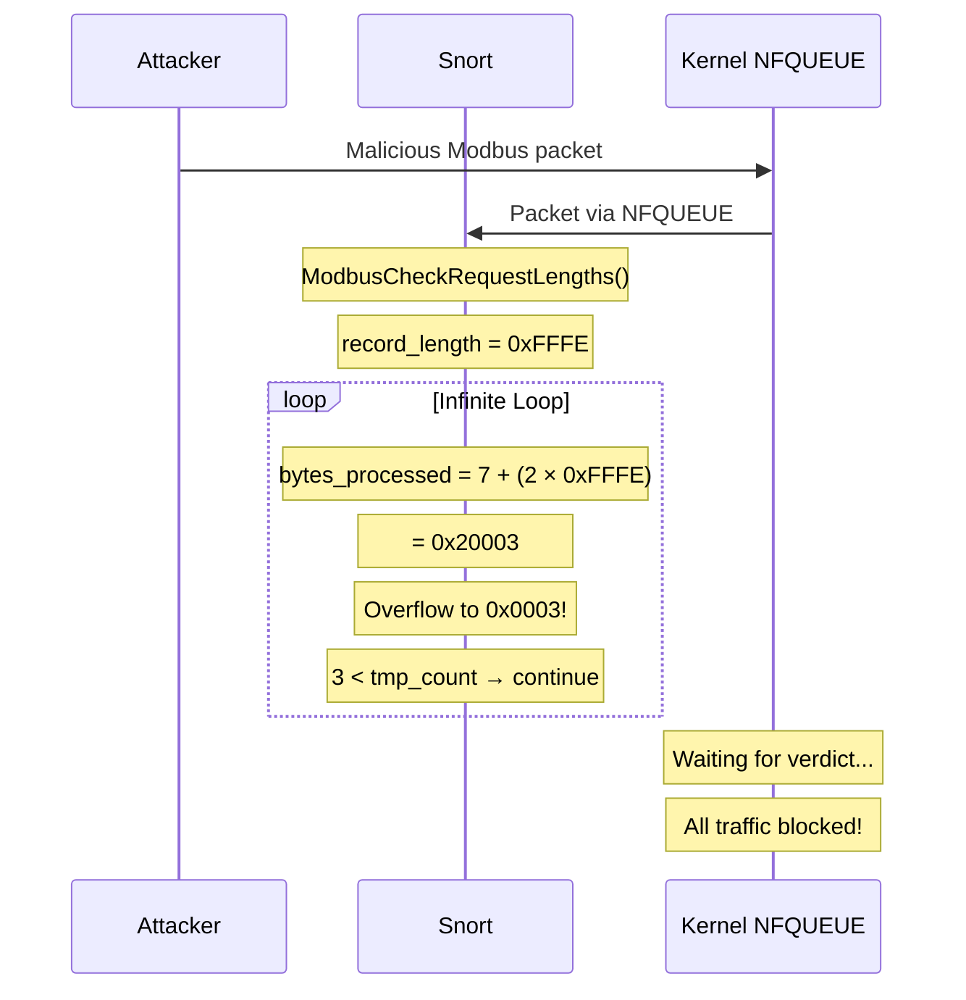

#### Vulnerable Code

```c
/* Snort 2.9.18 - modbus_decode.c */
static int ModbusCheckRequestLengths(...) {
    uint16_t bytes_processed = 0;  /* Only 16 bits! */
    uint16_t record_length;

    while (bytes_processed < tmp_count) {
        /* Read record_length from packet */
        record_length = *(uint16_t *)(payload + offset);

        /* INTEGER OVERFLOW BUG! */
        bytes_processed += 7 + (2 * record_length);

        /* When record_length = 0xFFFE:
         * 7 + (2 × 0xFFFE) = 0x20003
         * Truncated to uint16_t: 0x0003
         * Loop condition (3 < tmp_count) stays TRUE!
         */
    }
}
```

#### Integer Overflow Visualization

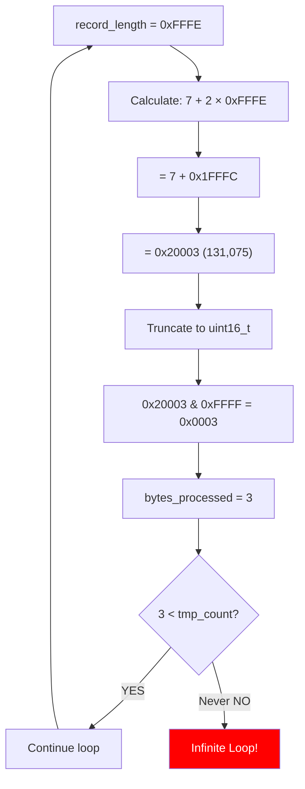

#### Impact

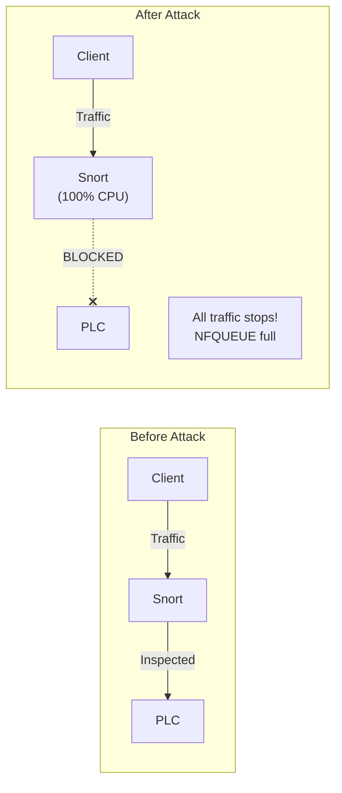

#### Protection Comparison

| Path | Result | Reason |
|------|--------|--------|
| Snort (503) | **VULNERABLE** | Preprocessor has bug |
| seL4 (502) | **IMMUNE** | No Modbus preprocessor |
| Direct (5020) | **N/A** | Not applicable |

---

## Security Architecture Comparison

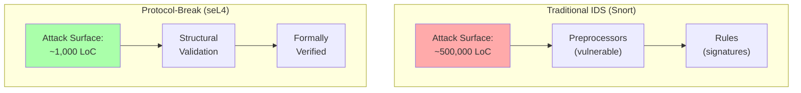

### Why Protocol-Break is More Secure

| Aspect | Packet-Forwarding | Protocol-Break |
|--------|-------------------|----------------|
| TCP State | Shared (attackable) | Isolated |
| Attack Surface | Large (full IDS) | Minimal |
| Unknown Attacks | Missed (no signature) | Blocked (structural) |
| IDS Vulnerabilities | Exposed | Not applicable |
| Verification | Testing only | Formal proofs |
