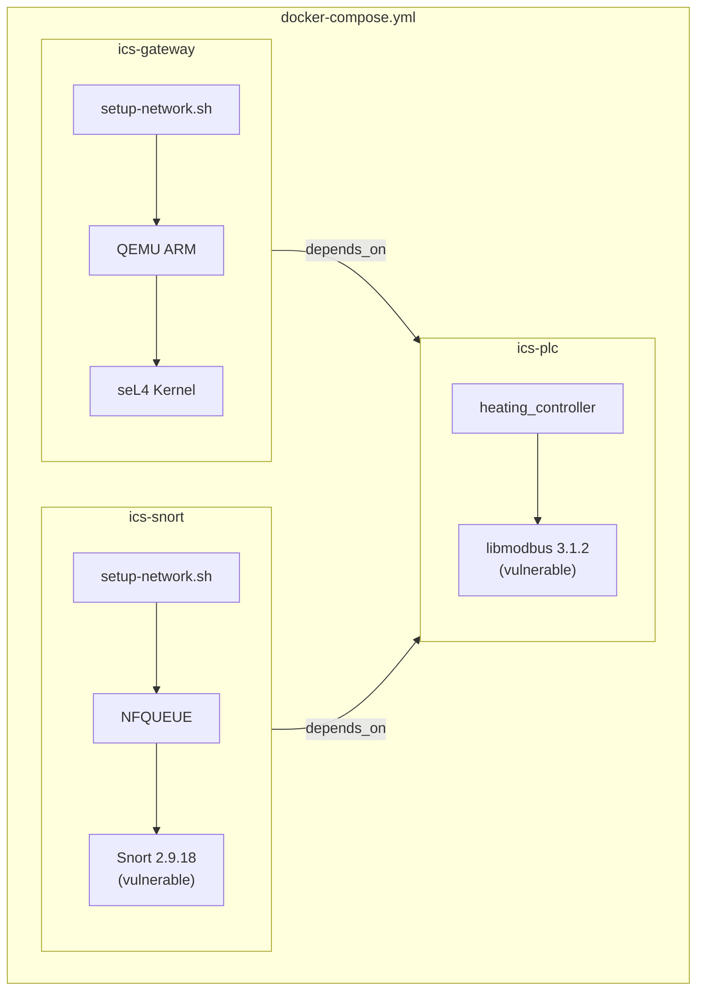
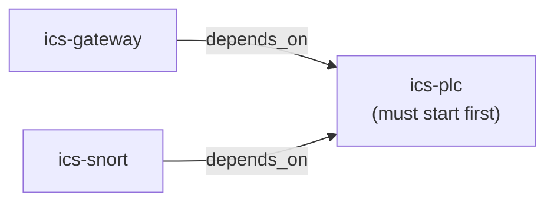
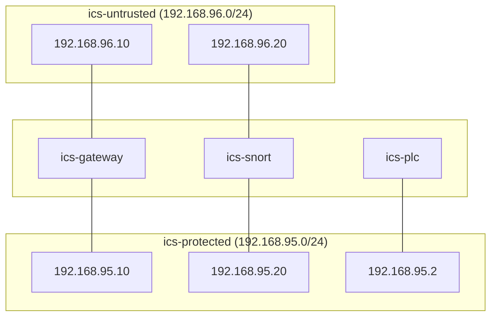
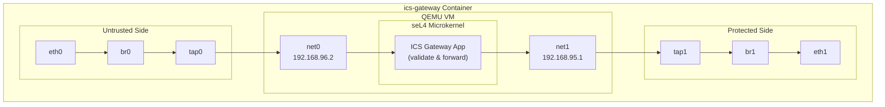
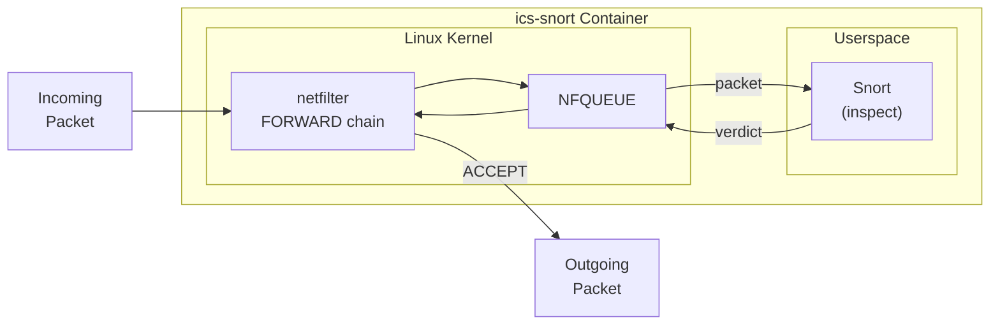
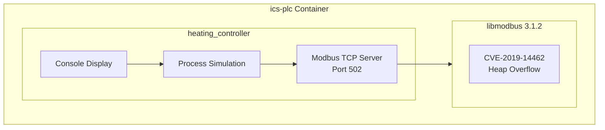

# Docker Container Architecture

This document describes the Docker container relationships and internal architecture.

## Container Overview

## Container Dependencies

| Container | Depends On | Reason |
|-----------|------------|--------|
| ics-plc | - | Base service |
| ics-gateway | ics-plc | Needs PLC to forward traffic to |
| ics-snort | ics-plc | Needs PLC to forward traffic to |

## Network Attachment

| Container | ics-untrusted | ics-protected |
|-----------|---------------|---------------|
| ics-gateway | Yes | Yes |
| ics-snort | Yes | Yes |
| ics-plc | No | Yes |

## seL4 Gateway Internal Architecture

The gateway container runs QEMU with the seL4 microkernel inside.

### Bridge Configuration

| Bridge | Interface | TAP | QEMU NIC | Purpose |
|--------|-----------|-----|----------|---------|
| br0 | eth0 (untrusted) | tap0 | net0 | Client-facing |
| br1 | eth1 (protected) | tap1 | net1 | PLC-facing |

## Snort NFQUEUE Architecture

Snort operates in inline IPS mode using NFQUEUE.

### How NFQUEUE Works

1. Packet arrives at `netfilter` FORWARD chain
2. iptables rule sends packet to `NFQUEUE`
3. Snort receives packet, inspects with preprocessors
4. Snort returns verdict: `ACCEPT` or `DROP`
5. Kernel forwards or drops based on verdict

**Key point:** Packets are held in queue until Snort responds. If Snort hangs (CVE-2022-20685), all traffic stops.

## PLC Container

Simple container running the vulnerable heating controller.

## Container Capabilities

| Container | Privileged | NET_ADMIN | Reason |
|-----------|------------|-----------|--------|
| ics-gateway | Yes | Yes | Bridge/tap creation, QEMU |
| ics-snort | Yes | Yes | NFQUEUE, iptables |
| ics-plc | No | No | Simple application |
