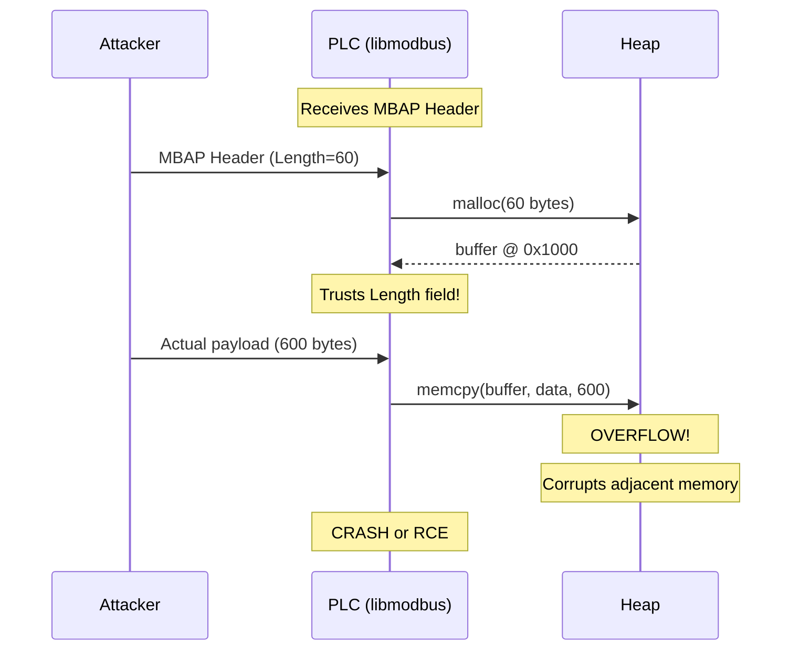
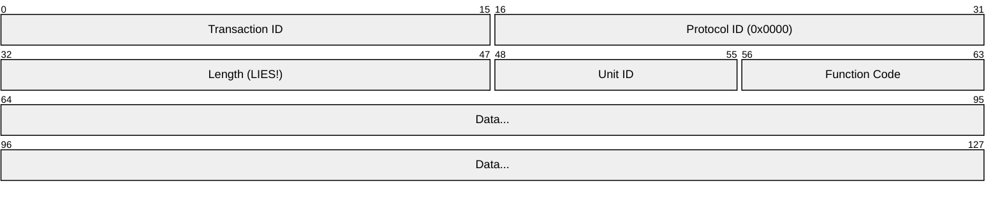
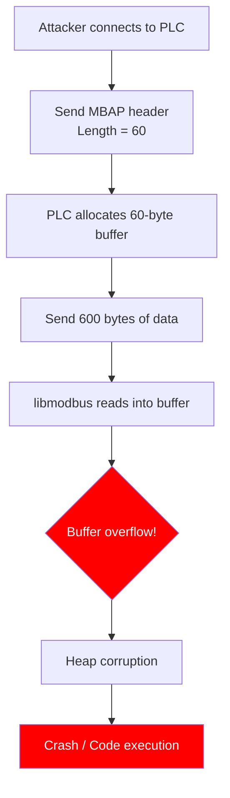
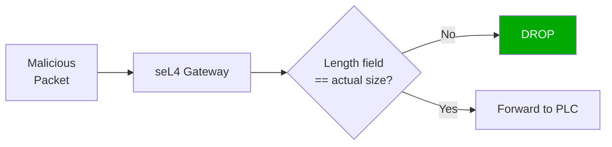
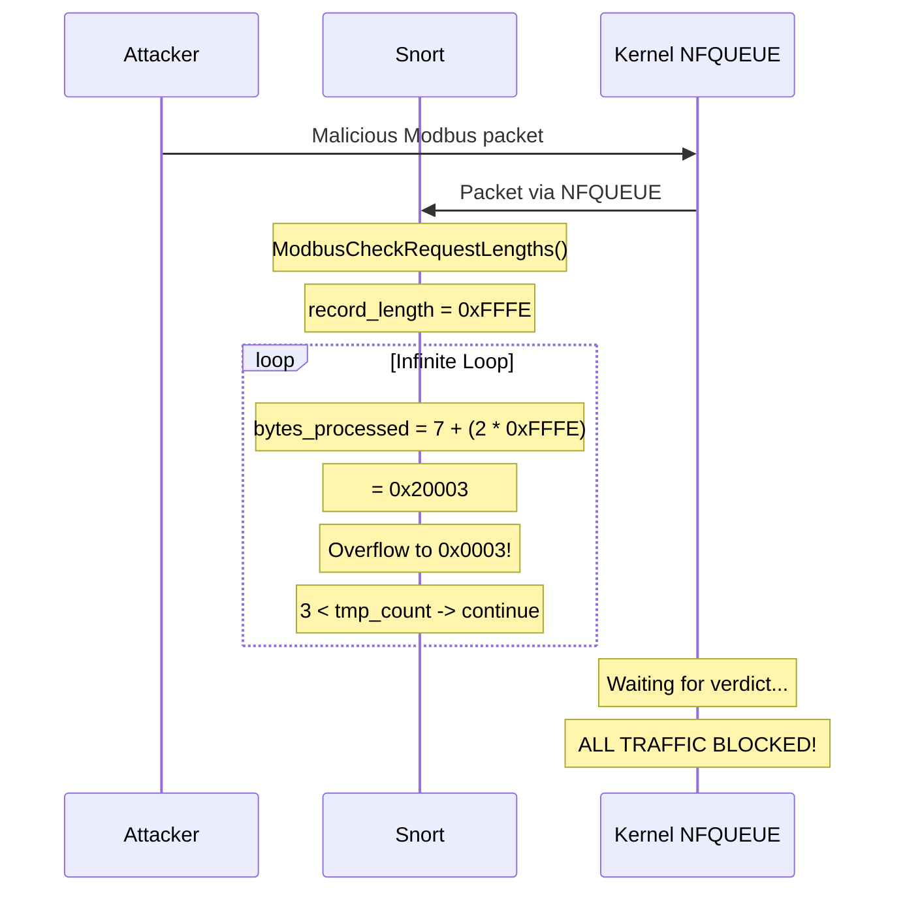
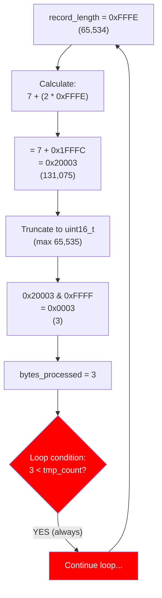
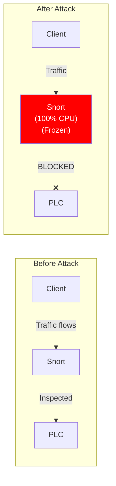
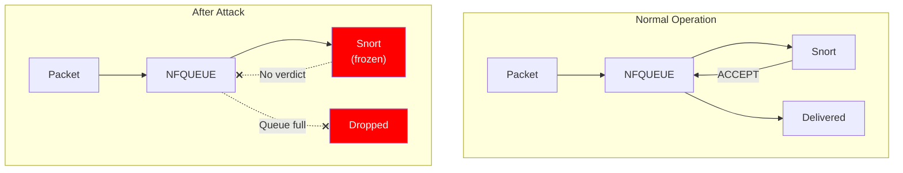
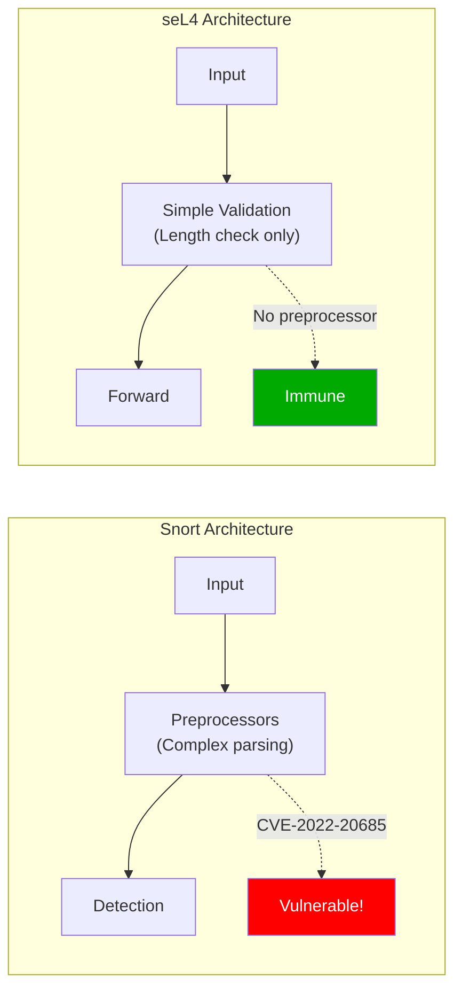
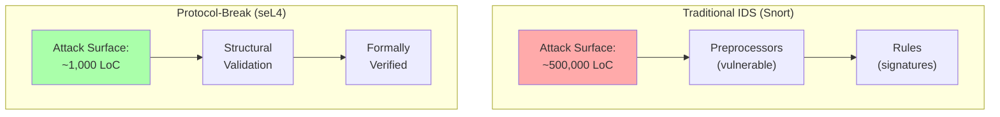

# CVE Explanations

This document provides detailed explanations of the vulnerabilities demonstrated in this project.

## CVE-2019-14462: libmodbus Heap Buffer Overflow

| Field | Value |
|-------|-------|
| **Affected** | libmodbus <= 3.1.2 |
| **Severity** | High (CVSS 9.8) |
| **Type** | Heap Buffer Overflow |
| **Impact** | Denial of Service, potential RCE |

### Description

The vulnerability exists because libmodbus trusts the `Length` field in the Modbus TCP MBAP header without validating it against the actual received data.

### Attack Mechanism



### Vulnerable Code

Location: `libmodbus 3.1.2 - src/modbus.c`

```c
static int receive_msg(modbus_t *ctx, uint8_t *msg) {
    /* Read MBAP header (7 bytes) */
    rc = recv(ctx->s, msg, 7, 0);

    /* Extract length from header - TRUSTED WITHOUT VALIDATION! */
    length = (msg[4] << 8) | msg[5];

    /* Read remaining data based on declared length */
    rc = recv(ctx->s, msg + 7, length - 1, 0);

    /* BUG: Attacker can send more bytes than declared!
     * The recv() will read up to 'length-1' bytes,
     * but TCP stream may contain more data that
     * gets processed in subsequent calls */
}
```

### Modbus TCP Packet Structure



### Attack Packet

| Field | Offset | Value | Description |
|-------|--------|-------|-------------|
| Transaction ID | 0-1 | 0x0001 | Request identifier |
| Protocol ID | 2-3 | 0x0000 | Modbus protocol |
| **Length** | 4-5 | **60** | **LIES! Claims 60 bytes** |
| Unit ID | 6 | 0x01 | Slave address |
| Function Code | 7 | 0x03 | Read Holding Registers |
| Overflow Data | 8-607 | 0xDEADBEEF... | **600 bytes of overflow** |

### Exploitation Flow



### Protection Comparison

| Path | Port | Result | Reason |
|------|------|--------|--------|
| Direct | 5020 | **CRASH** | No validation |
| seL4 Gateway | 502 | **BLOCKED** | Length field validated against actual data |
| Snort IDS | 503 | **DEPENDS** | Requires specific detection rule |

### How seL4 Blocks This Attack



---

## CVE-2022-20685: Snort Modbus Preprocessor DoS

| Field | Value |
|-------|-------|
| **Affected** | Snort < 2.9.19, Snort 3 < 3.1.11.0 |
| **Severity** | High (CVSS 7.5) |
| **Type** | Integer Overflow → Infinite Loop |
| **Impact** | Complete IDS Denial of Service |

### Description

The Snort Modbus preprocessor has an integer overflow vulnerability in the `ModbusCheckRequestLengths()` function. A specially crafted packet causes an infinite loop, freezing Snort and blocking all traffic.

### Attack Mechanism



### Vulnerable Code

Location: `Snort 2.9.18 - src/dynamic-preprocessors/modbus/modbus_decode.c`

```c
static int ModbusCheckRequestLengths(modbus_session_data_t *session,
                                     SFSnortPacket *packet) {
    uint16_t bytes_processed = 0;  /* Only 16 bits! */
    uint16_t tmp_count;
    uint16_t record_length;

    /* ... */

    while (bytes_processed < tmp_count) {
        /* Read record_length from packet data */
        record_length = *(uint16_t *)(payload + bytes_processed + 5);

        /* INTEGER OVERFLOW BUG! */
        bytes_processed += 7 + (2 * record_length);

        /*
         * When record_length = 0xFFFE:
         *   7 + (2 * 0xFFFE) = 7 + 0x1FFFC = 0x20003
         *
         * But bytes_processed is uint16_t (max 0xFFFF):
         *   0x20003 & 0xFFFF = 0x0003
         *
         * Loop condition: 3 < tmp_count = TRUE
         * Result: INFINITE LOOP!
         */
    }
}
```

### Integer Overflow Visualization



### Attack Packet Structure

| Field | Offset | Value | Description |
|-------|--------|-------|-------------|
| Transaction ID | 0-1 | 0x0001 | Request identifier |
| Protocol ID | 2-3 | 0x0000 | Modbus protocol |
| Length | 4-5 | 0x0011 | 17 bytes |
| Unit ID | 6 | 0x01 | Slave address |
| Function Code | 7 | 0x15 | Write File Record |
| Request Length | 8 | 0x0E | 14 bytes |
| Reference Type | 9 | 0x06 | Required value |
| Padding | 10-13 | 0x00 | - |
| **record_length** | 14-15 | **0xFFFE** | **Triggers overflow (1st read)** |
| Padding | 16 | 0x00 | - |
| **record_length** | 17-18 | **0xFFFB** | **Triggers overflow (2nd read)** |
| Padding | 19-22 | 0x00 | - |

### Impact on Traffic



### Why NFQUEUE Makes This Devastating



**Key insight:** In NFQUEUE inline mode, packets are held in the kernel queue until Snort returns a verdict. When Snort hangs, no verdicts are returned, and ALL traffic stops.

### Protection Comparison

| Path | Port | Result | Reason |
|------|------|--------|--------|
| Snort IDS | 503 | **VULNERABLE** | Preprocessor has the bug |
| seL4 Gateway | 502 | **IMMUNE** | No Modbus preprocessor |
| Direct | 5020 | N/A | Snort not in path |

### Why seL4 is Immune



---

## Security Comparison Summary



| Aspect | Packet-Forwarding (Snort) | Protocol-Break (seL4) |
|--------|---------------------------|----------------------|
| Attack Surface | ~500,000 LoC | ~1,000 LoC |
| CVE-2019-14462 | Requires rule | Blocked by design |
| CVE-2022-20685 | Vulnerable | Immune |
| Unknown Attacks | Missed (no signature) | Blocked (structural) |
| TCP State | Shared (attackable) | Isolated |
| Verification | Testing only | Formal proofs |
