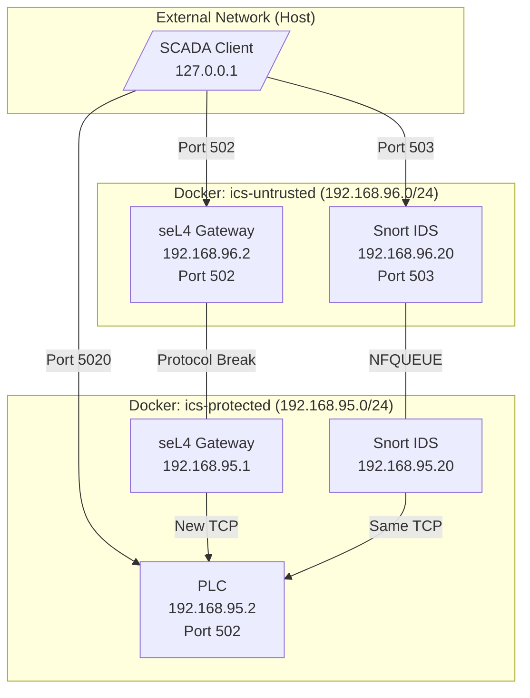
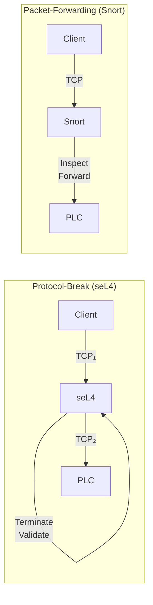
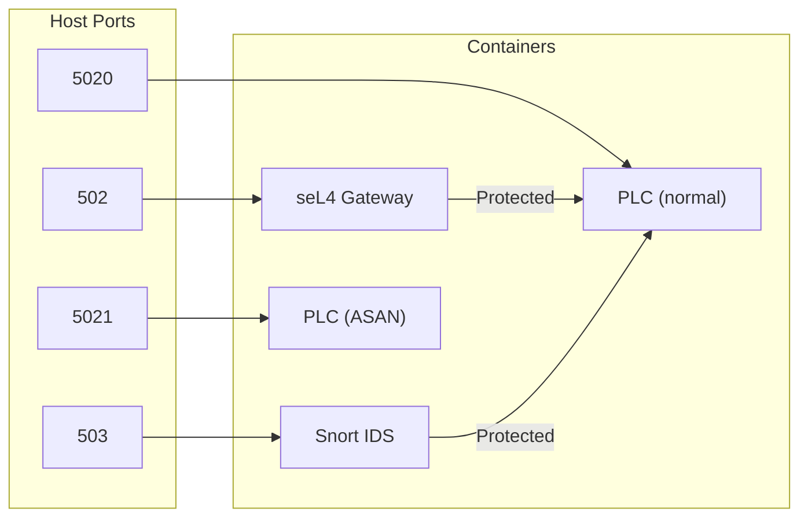
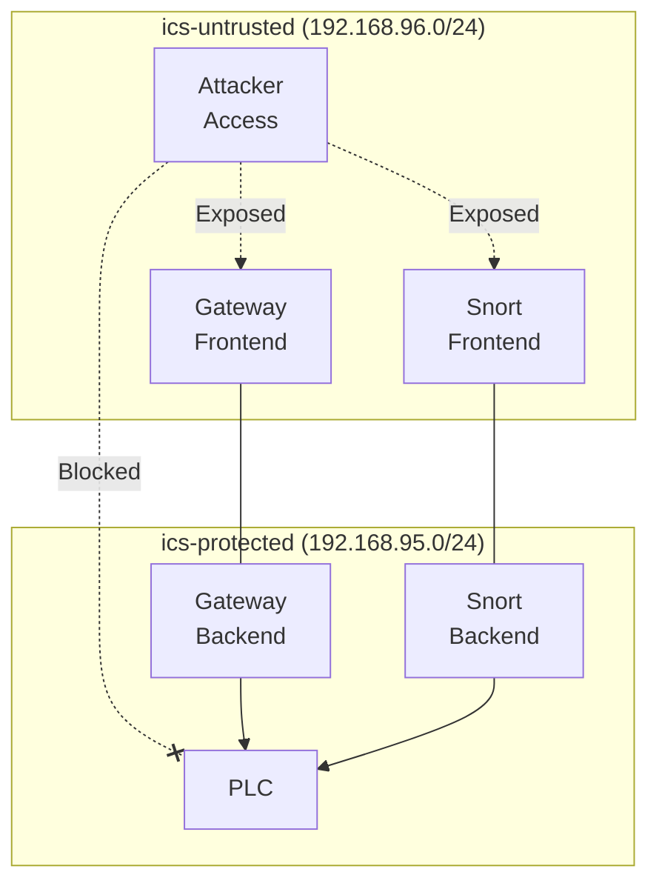

# Network Architecture

This document describes the network architecture of the seL4 ICS Gateway Demo.

## Overview

The demo uses two isolated Docker networks to simulate an industrial control system with a security gateway.

## Traffic Flow Comparison

### Protocol-Break vs Packet-Forwarding

| Aspect | Protocol-Break | Packet-Forwarding |
|--------|----------------|-------------------|
| TCP Connections | Two independent | One end-to-end |
| State Isolation | Complete | None |
| Validation | Before forwarding | During forwarding |

## Port Mapping

| Port | Path | Architecture | Protection |
|------|------|--------------|------------|
| 502 | Client → seL4 → PLC | Protocol-break | Validates Modbus structure |
| 503 | Client → Snort → PLC | Packet-forwarding | Rule-based IDS |
| 5020 | Client → PLC | Direct | None (vulnerable) |
| 5021 | Client → PLC (ASAN) | Direct | CVE verification |

## Network Segmentation

### Two-Network Design

**Security Benefit:** The PLC is only accessible through the gateway or Snort, never directly from the untrusted network.

## IP Address Summary

| Component | Untrusted Network | Protected Network |
|-----------|-------------------|-------------------|
| seL4 Gateway | 192.168.96.2 | 192.168.95.1 |
| Snort IDS | 192.168.96.20 | 192.168.95.20 |
| PLC | - | 192.168.95.2 |
